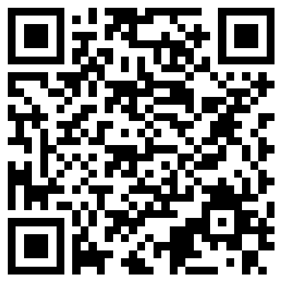

# Tutoraggio Informatica
Repository contenente le risoluzioni dei temi d'esame svolti durante il tutoraggio di Informatica 2023 - II periodo. 

[Link ai testi dei temi d'esame](https://github.com/polito-info-2022/Esempi-esame)

[Link alla classe virtuale](https://teams.microsoft.com/dl/launcher/launcher.html?url=%2F_%23%2Fl%2Fmeetup-join%2F19%3Ameeting_ZmVjOWIwNzAtOTJjMy00N2YwLWIwNDYtMjYxODAyNWU3NDI1%40thread.v2%2F0%3Fcontext%3D%257b%2522Tid%2522%253a%25222a05ac92-2049-4a26-9b34-897763efc8e2%2522%252c%2522Oid%2522%253a%2522ed8ef391-9437-45f1-aa9f-374afc00ec34%2522%257d%26anon%3Dtrue&type=meetup-join&deeplinkId=642c5aa9-0fcf-4760-9654-616c53bff424&directDl=true&msLaunch=true&enableMobilePage=true&suppressPrompt=true)

## QR Code Github Tutoraggio

## Calendario Tutoraggi

### ATTENZIONE
Le registrazioni sono solo disponibili agli utenti del Politecnico di Torino  
Per visualizzare la registrazione della risoluzione del tema d'esame è necessario autenticarsi alla piattaforma Teams utilizzando le credenziali del Portale Della Didattica.

|  Giorno|  Tema esame svolto | Link  Registrazione|
|--------|---------------|---------------------|
| 27/04  | Costi Stampa  |[Link](https://politoit-my.sharepoint.com/:v:/g/personal/s308696_studenti_polito_it/ESpObnW93jZHjEKeR_Txt5gBsFAFSv-GDlT9xAzKtBS90Q?e=wP99K2) |
| 27/04  | Agenda        |[Link](https://politoit-my.sharepoint.com/:v:/g/personal/s308696_studenti_polito_it/EbqY9YzAeWJFgWYgJrhzzk0B_D2LpVmkPZiJdWTOoCVFvw?e=abbtWT) |
| 04/05  | Gestione del prestito PC aziendali (1° parte)|[Link](https://politoit-my.sharepoint.com/:v:/g/personal/s308696_studenti_polito_it/EcYz0Y8z_YVHpdUnDudMyuEBkEmLjgDh3Z0md61qTaT5PQ?e=sc1CJs)   |
| 04/05 |  Viaggio della slitta|  [Link](https://politoit-my.sharepoint.com/:v:/g/personal/s308696_studenti_polito_it/Ebsc7cL0qVJOmx5RLUY0u7IBxY3QexQetOk6mabuOOKW_g?e=fnXXKV) |
| 08/05 | Gestione del prestito PC aziendali (2° parte)  |[Link](https://politoit-my.sharepoint.com/:v:/g/personal/s308696_studenti_polito_it/EVmtwdjciTNMrV7vUsSneqIBmNKzd6xAzW04aPBPQIEl2w?e=ICJcG8)|
| 08/05 | Verifica requisiti di Laurea (1° parte)  |[Link](https://politoit-my.sharepoint.com/:v:/g/personal/s308696_studenti_polito_it/EdHUqnOhEwRCgO2RYrO8RWsBqW37QG2lQysyGws2roMxjg?e=tFp6Yh) |
| 11/05 |Verifica requisiti di Laurea (2° parte) |[Link](https://politoit-my.sharepoint.com/:v:/g/personal/s308696_studenti_polito_it/Eey-3qZOfsBBrjjMcVp14IcBQr1WUQjSdB_-KCACgyVXEA?e=qsecbX)
| 11/05 | Mappa Laser|[Link](https://politoit-my.sharepoint.com/:v:/g/personal/s308696_studenti_polito_it/EQlduqUjIb1FqgePmvkrf4oBUeZx8AuTASmzCmBV-mSr3A) |
| 14/05 | Ricerca comuni|[Link](https://politoit-my.sharepoint.com/:v:/g/personal/s308696_studenti_polito_it/Ee83k-WWgV9FqffvGr1qJzQBpYQWcejXB9VlXs-o4KV2bw)|
| 18/05 | Paniere dei prezzi in Newfoundland |[Link 1° parte](https://politoit-my.sharepoint.com/:v:/g/personal/s308696_studenti_polito_it/EYLE0t3-ZS9JsWD0vUJL-AYBGEACcejIRMC3P2YN1HppbA?e=5Vw6Xb)  -  [Link 2° parte](https://politoit-my.sharepoint.com/:v:/g/personal/s308696_studenti_polito_it/ETZHE-AkPqBHg0HvkskmVckBjXFW6NV2KBVW_YRiP8dV9g?e=Fo0PY9) |
| 18/05 | Gestione conto ristorante (1° parte) |[Link](https://politoit-my.sharepoint.com/:v:/g/personal/s308696_studenti_polito_it/EX57xOA07YtDubeeSTkXc_QB5psnPH0VEec-ZvUPFg1qJQ?e=QgeexS) |
| 22/05 | Piramidi |[Link](https://politoit-my.sharepoint.com/:v:/g/personal/s308696_studenti_polito_it/EWp2uxw9d71BvF8wuTOGdEMBbLtrquO67qo_3p1rGAW6bA?e=2PduLx) |
| 25/05 | Traiettoria Droni |[Link](https://politoit-my.sharepoint.com/:v:/g/personal/s308696_studenti_polito_it/Ed3NmRp_GdZNjETI4foEIAUBojrZultyOTd8qyaFGer9ng?e=LTw690) |
| 25/05 | Risultati Gara Podistica|[Link](https://politoit-my.sharepoint.com/:v:/g/personal/s308696_studenti_polito_it/EX7BdqKzqbFJlLxQhMF8D1oB1cslc4alidvIJfw_Ky1HiA?e=7alk07) |
| 29/05 | Stabilimento Balneare|[Link](https://politoit-my.sharepoint.com/:v:/g/personal/s308696_studenti_polito_it/EZLJCysDTFVIrQtZPUOgnkYB6v7BJ6-BT3eKsr5h5wE2Ig?e=Mzut7s)|
| 01/06 | Stazioni Meteo|[Link 1° parte](https://politoit-my.sharepoint.com/:v:/g/personal/s308696_studenti_polito_it/Ee1p_Pj0siFKuE_rNUi--ecBi84mmElVEScFRQZkwdZS7w?e=CDAaTk)  -  [Link 2° parte](https://politoit-my.sharepoint.com/:v:/g/personal/s308696_studenti_polito_it/EdZIGR3-ibNLs-URzZ7YxkwBVT8twW2H6OUpfiuqJkz4nw?e=6mmnDp)|
| 04/06 | Domande di Teoria - Sistemi di numerazione|[Link](https://politoit-my.sharepoint.com/:v:/g/personal/s308696_studenti_polito_it/EVpICDOhiGxJm_gnMd-4Mk4Bn6vpdbZpliFyg7zM5zh_ZQ?e=FwJ0TB) |
| 08/06 AULA 12 | Domande di Teoria - Sistemi di numerazione |[Link](https://politoit-my.sharepoint.com/:v:/g/personal/s308696_studenti_polito_it/ES9ry-QSTHlEmBMwZBdsWmYB-P3TyGe_iyi9Z2UvBpPlsw?e=VvKoza)|
| 08/06 AULA 12 | Gestione allarmi robot |[Link](https://politoit-my.sharepoint.com/:v:/g/personal/s308696_studenti_polito_it/EX7YZRpYgtVNmu1b8n0LcIkB11XSUBvR6dXGWxJPztxBZg?e=D0AVwC)|
| 12/06 AULA 5S ORE 16:00 - 19:00 | Impact Factor |[Link](https://politoit-my.sharepoint.com/:v:/g/personal/s308696_studenti_polito_it/EcTP_aNqKOpFpiqd9R3xOSABm6deKhSfOHFq63rAWK4udw?e=EahnfJ) - [Link commento finale](https://politoit-my.sharepoint.com/:v:/g/personal/s308696_studenti_polito_it/EdrMjOEw1bxKgnH32Ijyy00BHI1fSzOgOWUohg5orO4myw?e=tZHcpF) |
| 12/06 AULA 5S ORE 16:00 - 19:00 | Glucometer|[Link](https://politoit-my.sharepoint.com/:v:/g/personal/s308696_studenti_polito_it/EU-yqxTLkg9Nnf_i5TsLQpoB854-TWWd7oGRGIzZY1GqDg?e=0qKbyt)|
| 12/06 AULA 5S ORE 16:00 - 19:00 | Domande di Teoria - Architettura degli elaboratori |[Link](https://politoit-my.sharepoint.com/:v:/g/personal/s308696_studenti_polito_it/EW8PUcBo4CZOoXrsgFML1nEBpXWeEZWTBwohLvCcr9RhEg?e=TbhdlE)|
| 13/06 AULA 5S ORE 16:00 - 19:00| Estrazioni del Lotto|[Link](https://politoit-my.sharepoint.com/:v:/g/personal/s308696_studenti_polito_it/ESpKVW-UwzVNgJEE4LO8Yq0B3vHizXnynPLJ706Htx9qhA?e=16LXeT)|
| 13/06 AULA 5S ORE 16:00 - 19:00 | Intercettazione Polizia|[Link](https://politoit-my.sharepoint.com/:v:/g/personal/s308696_studenti_polito_it/EbosiT4U0ZpFixI7x2dUW0AB5DvrdxY2tMaD7xWFOrIUBA?e=NQlHt7)|
| 14/06 AULA 5S ORE 16:00 - 19:00| Astrologia Calciatori|[Link](https://politoit-my.sharepoint.com/:v:/g/personal/s308696_studenti_polito_it/EcUKiniJLa5CuLHIYYOC2n8BtdA8nowoWojXRMCpyklFAg?e=8Gmiu6)|
| 14/06 AULA 5S ORE 16:00 - 19:00 | Mezzi Pubblici|[Link](https://politoit-my.sharepoint.com/:v:/g/personal/s308696_studenti_polito_it/EdcBkfodsa1OhyeHV-rg2nABI1bPrvufx1-nbzZkqS7_Uw?e=cAUq6K)|
|21/06  AULA 7S ORE 16:00 -19:00| Controllo Compiti Copiati |
|21/06  AULA 7S ORE 16:00 -19:00| Hacking |
|<b>26/06  AULA 9S ORE 16:00 -19:00<b>|  |
|<b>26/06  AULA 9S ORE 16:00 -19:00<b>||
